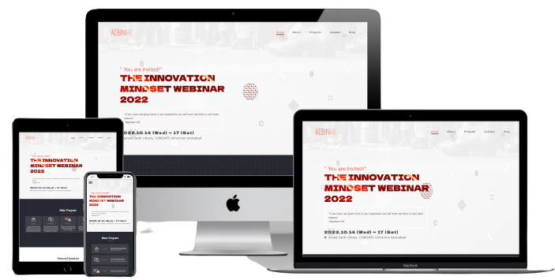

# 📗 Table of Contents

- [📖 About the Project](#about-project)
  - [🛠 Built With](#built-with)
    - [Tech Stack](#tech-stack)
    - [Key Features](#key-features)
  - [🚀 Live Demo](#live-demo)
- [💻 Getting Started](#getting-started)
  - [Prerequisites](#prerequisites)
  - [Setup](#setup)
  - [Start server](#start-server)
  - [Usage](#usage)
- [👥 Authors](#authors)
- [🔭 Future Features](#future-features)
- [🤝 Contributing](#contributing)
- [⭐️ Show your support](#support)
- [❓ FAQ](#faq)
- [👏 Acknowledgement](#acknowledgments)
- [📝 License](#license)

# 📖 [AebinAR] <a name="about-project"></a>

> A website, to connect an audience and provide them with remote access to a platform for taking online seminars (webinar). 

> - Display a list of speakers.
> - Display programs available.
> - Share a blog about the most recent webinar. 


## 🛠 Built With <a name="built-with"></a>

### Tech Stack <a name="tech-stack"></a>
<details>
  <summary>Client</summary>
  <ul>
    <li><a href="https://www.javascript.com/">Javascript</a></li>
  </ul>
</details>

### Key Features <a name="key-features"></a>

- **[Display list of programs available]**
- **[Display speakers of webinar]**
- **[Share a blog about the most recent webinar]**

Click this [Video](https://www.loom.com/share/10df897914bc4e029701a413df19c05f) to learn all about the features of this website 

## 🚀 Live Demo <a name="live-demo"></a>

Click here to see the [Live Demo](https://shella12.github.io/AebinAR.github.io/) of the website

 

## 💻 Getting Started <a name="getting-started"></a>

To get a local copy up and running follow these simple example steps.

### Prerequisites

In order to run this project you need:
- Browser (Firefox / Google Chrome)
- An IDE (e.g. VS code)

### Setup

Clone this repository to your desired folder:

```sh
  cd my-folder
  git clone git@github.com:shella12/AebinAR.github.io.git
```

### Start server

> download `live server` or open in browser

### Usage

Connect an audience from all over the world to participate in the webinars. Never loose any event or meeting. Broadcast, presentation, screen sharing, polls and assessment, chat, Q&A will support your full immersion in the process. If you want to ask question with voice, just do it in one click.


## 👥 Authors <a name="authors"></a>

- GitHub: [@shella12](https://github.com/shella12)
- Twitter: [@Ayesha Arshad](https://twitter.com/AyeshaA03712974)
- LinkedIn: [Ayesha Arshad](https://www.linkedin.com/in/ayesha-arshad-a690a015a/)

## 🤝 Contributing <a name="contributing"></a>

Contributions, issues, and feature requests are welcome!

Feel free to check the [issues page](../../issues/).

## ⭐️ Show your support <a name="support"></a>

Give a ⭐️ if you like this project!

## ❓ FAQ <a name="faq"></a>

- **[Why use this app?]**

  - [To start or attend webinars]

- **[Why build this app?]**

  - [Its a good project fro beginners to learn HTML, CSS, Javascript and DOM manupilation]

## Acknowledgments <a name="acknowledgments"></a>

- Microverse documentation
- Design by [Cindy Shin](https://www.behance.net/adagio07)

## 📝 License <a name="license"></a>

This project is [MIT](./LICENSE) licensed.
